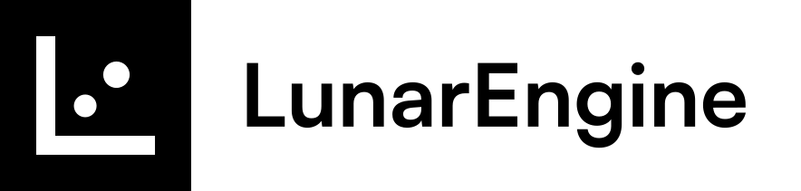
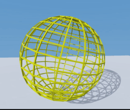
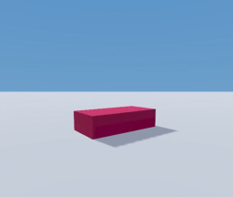
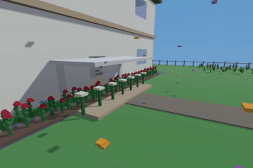
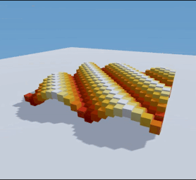

# Lunar Engine (demo)
<div style="display:flex; align-items:center; gap:20px; margin:10px 0;">
  <a href="https://discord.gg/N66awhg7" style="text-decoration:none;">
    
  </a>
  <a href="https://github.com/librebox-devs/librebox-demo/releases" style="text-decoration:none;">
    
  </a>
</div>

<br/>
<p>
  
</p>

## Open-source Luau 3D engine (API-compatible)

<div style="display:flex; flex-wrap:wrap; align-items:flex-start; gap:10px;">
  
  
  <div style="flex-basis:100%; height:0;"></div> <!-- forces new row -->
  
</div>


### What is Lunar Engine?
**Lunar Engine** (formerly **Librebox**) is an open-source game engine powered by Luau. It delivers a sandbox-style API and development model inspired by popular sandbox engines, so existing Luau code runs with minimal changes.

### Why Lunar?
Lunar Engine gives developers full agency over their games - from the code to the engine. Build immersive experiences with a familiar interface while maintaining complete ownership of your platform.

### Example

Create a part in the Workspace, while rotating and cycling its color.
```lua
-- examples/part_example.lua
local part = Instance.new("Part") -- Create a part
part.Anchored = true -- compat
part.Color = Color3.new(1,0,0) -- Make the part red
part.Position = Vector3.new(0,2.5,0) -- Position it
part.Parent = workspace -- Put it into workspace

local rs = game:GetService("RunService")
local t = 0

rs.RenderStepped:Connect(function(dt)
	t += dt
	part.CFrame = CFrame.new(part.Position) * CFrame.Angles(0, t, 0) -- rotate in place with CFrame
	part.Color = Color3.fromHSV((t*0.2 % 1), 1, 1) -- set part color
end)
```
```
> ./LibreboxPlayer.exe examples/part_example.lua
```


### Compatibility

Lunar Engine is currently in demo stage (it implements a limited subset of its planned API), but here is what is supported:

- Basic scene rendering
  - Lighting, shadows, ambient, skybox
    - Parts render within `game.Workspace`
  - Basic camera movement
  - Based on 'Libre-1' (to change in the future)
- Standard data types
  - `CFrame`, `Vector3`, `Color3`, `Random`
  - `game`, `script`, `workspace`
- Instance System
  - Nearly complete Instance API (missing `:WaitForChild()`)
  - `<instance>.Parent`
  - `:Destroy()`, `:Clone()`
- Parts
  - Implements `BasePart`
  - `Instance.new("Part")`
  - `Part.Color`, `Part.Transparency`, `Part.Size`
  - `Part.Position`, `Part.CFrame`
  - More support in the future
- Client-sided services
  - `Workspace`
    - `workspace.CurrentCamera`
    - Default rendering stage
  - `RunService`
    - All five standard stages, including `RenderStep` and `HeartBeat`
    - `game.RunService.RenderStepped:Wait()`, `:Connect()`
  - `Lighting`
    - `game.Lighting.Ambient`
    - `game.Lighting.ShadowSoftness`
    - `game.Lighting.ClockTime`
    - `game.Lighting.Brightness`
  - `game:GetService()`
- Luau script support
  - Highly capable 'Hyperball' task scheduler
  - `RBXScriptSignal`, Event binding, connections
  - Coroutines, Scripts, LocalScripts
  - `task.spawn`, `task.wait`, `task.delay`
  - Luau optimization enabled by default
- Window handling and fullscreen optimization
---

### Download
[Download releases here.](https://github.com/librebox-devs/librebox-demo/releases)

### To Be Added

Of course, this is just a rendering demo. Lunar Engine is extensible and easily supports the additions of new services and features. 

In the next release, we will incorporate `UserInputService` and `StarterPlayer`, turning Librebox into an actual interactive engine.

### Platforms
Lunar Engine currently supports Windows, but **can easily be ported anywhere**. The only dependencies are 'raylib' -- and raylib is already cross-platform.

* Windows 7+ (`.exe`)
  * Standalone executable (LibreboxPlayer.exe)
  
### Future Support

Right now, Lunar Engine compatibility is limited. This is currently a demo (not even a release!). In future releases, you can expect the following:

* Physics
  * Collision events, aspects
* Mesh support
* game.Players, Player
* UserInputService, ContextActionService
* Image rendering, decals
* Onscreen GUIs
* Materials, stronger rendering

And, in the future.
* Replication support (and Servers)

Librebox is on its way to becoming a fully fledged engine -- just like Godot, or Unity, you can transfer your current Lua skills into Librebox, and create **games you own.**

### The future of Lunar Engine

In future releases, it could be entirely possible to:

* Create a game within the Lunar Editor (assets and scripts)
* Deploy a Lunar server (just like a Minecraft server)
* Implement your own monetization
* Get the full user experience, and professional game development
  * No platform dependency
* Use your own APIs or rewrite the source code

This is entirely feasible, and, in fact, a good point for the existence of Lunar Engine. However, what we'd like to implement first is full client compatiblity (proper rendering, APIs). Then, this makes it easier to move on to servers.

And best of all, it is copyright free and open source (Lunar Engine is just an environment.) 

### Usage and Documentation

I'll add this ASAP. For building dependencies, use the 'build_dependencies.bat' script, and for building the engine, `build_engine.bat`
For the .exe, you can specify a path either as the first argument (lua script only), or as ``--path`` (script or folder). 
LibreboxPlayer.exe includes three arguments: ``--no-place``, ``--target-fps``, and ``--path``.

``--no-place``: (FLAG) Does not execute the default place initialization script (this includes the Baseplate.)
``--target-fps``: Strict the FPS to a certain value (default monitor refresh rate)
``--path``: Path to script

### Licenses
This project uses:

- Luau, licensed under the MIT License.  
  Copyright (c) 2025 Roblox Corporation.  
- raylib, licensed under the zlib/libpng License.  
  Copyright (c) 2013-2025 Ramon Santamaria and contributors.

### Legal Notice
> Lunar Engine is an independent open-source project. It is not affiliated with or sponsored by any commercial platform. All names and references are for interoperability only. Lunar Engine uses no third-party source code, assets, or proprietary materials.

### Contact
You can send requests or questions at ``librebox.developers@gmail.com``.

---
##### "LUNARENGINE IS JUST AN ENVIRONMENT"
